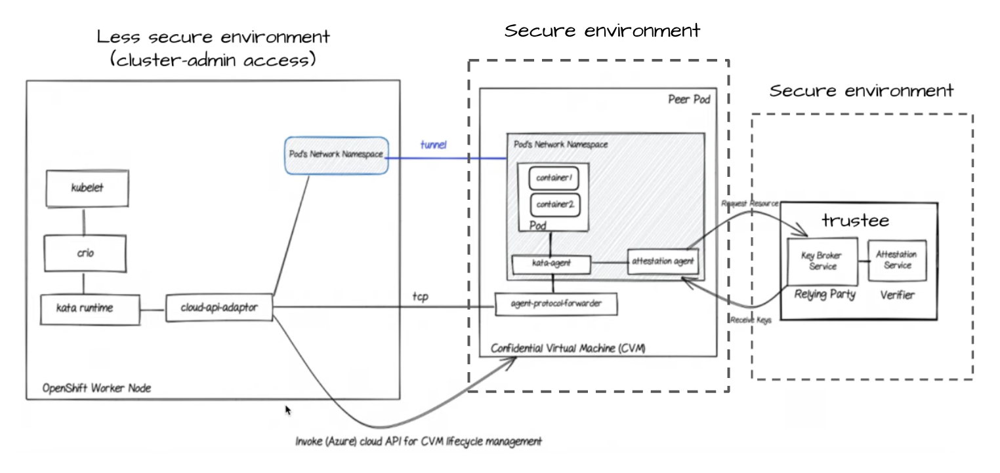

# Confidential Containers (CoCo) on Azure Red Hat OpenShift (ARO)

This repository contains automation and demonstration scripts for the "Understanding Confidential Containers - Workshop on ARO" from Red Hat Demo Portal. 

You need to deploy the workshop and run through Setup Phase 1 - Deploy Trustee Operator and configure. Then run through Setup Phase 2 - Deploy and configure OpenShift Sandboxed Containers (OSC) Operator etc. 

This repo can then be used to demonstrate workloads in this environment. 

### Architecture & Trust Model
The core value of this solution is the separation of duties between infrastructure management and data security. By using a Trusted Execution Environment (TEE), we ensure that even a Cluster Administrator cannot inspect the data inside a running pod.



**Getting Started**

**1. Prerequisites**
Prepare your RHEL Bastion environment (Kitty terminfo, pv, cowsay):
```bash
./utils/0-setup-demo-prereqs.sh
```

**2. Environment Variables**
Initialize your session with cluster-specific metadata:
```bash
source ./vars.sh
```

**3. Pre-flight Warmup**
Provision the Azure VMs in advance:
```bash
./utils/1-demo.pre-deploy.sh
```

**4. Run the demo**
```bash
./demo.sh
```


